# Trouble in Terrorist Town

Aims to replicate the [Trouble in Terrorist Town](https://www.troubleinterroristtown.com/)
gamemode of [Garry's Mod](https://store.steampowered.com/app/4000/Garrys_Mod/).

## Introduction
This gamemode features most of the mechanics of the original Garry's Mod version.
There are 3 roles:
- **🟢 Innocent**
	- Try to stay alive and figure out who the traitors are.
- **🔴 Traitor**
	- Kill all innocent players without being detected.
- **🔵 Detective**
	- Part of the innocent team.
	- Use items and your authority as a known innocent to your advantage.

## Features

### Weapon & Ammo Pickups

At the beginning of a round, before roles are drawn, players scramble to find weapons to defend themselves with. Guns of various strength are spread randomly across the map.

Weapons can be dropped using the `Nightvision` keybinding (<kbd>N</kbd> by default).
 

### Identifying Bodies
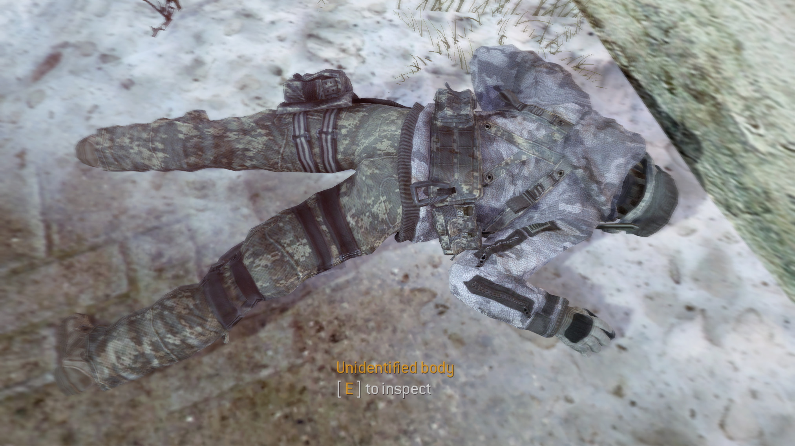

Once a player dies, their body can be identified by anyone who finds them.
Pressing the `Use` keybinding (<kbd>F</kbd> by default) on the body, announces their role
to all players.
 

### Scoreboard
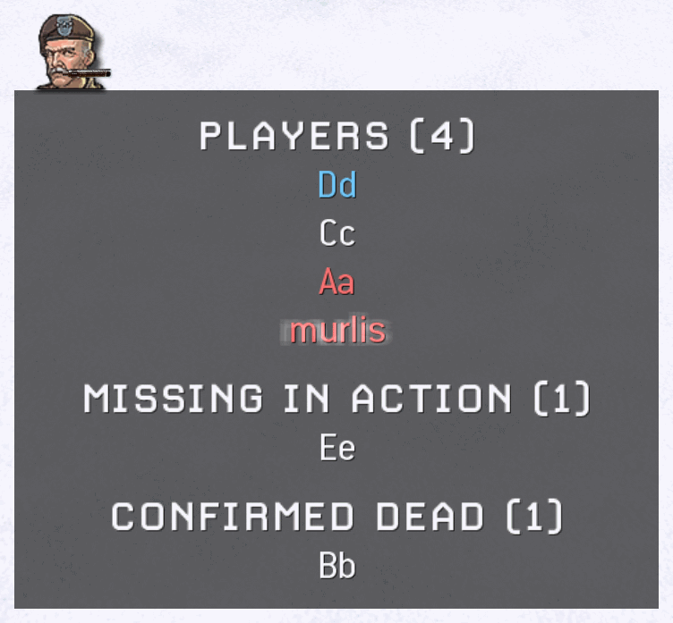

Over the course of the game, the custom scoreboard can be used (default <kbd>TAB</kbd>)
to keep an overview of the round's state. Innocent players are able to see
who has been confirmed dead due to their body being found.
Only traitors can additionally see, who is dead but not yet identified as such.
 

## Items

🖱️ <em>Click on an item's icon to learn more.</em>

 
<!--
--><!--
-->
 
<!--
--><a href="#armor">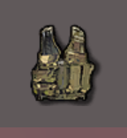</a><!--
--><!--
--><a href="#radar">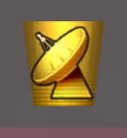</a><!--
--><!--
--><a href="#attack-helicopter">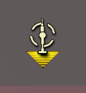</a><!--
--><!--
--><!--
--><!--
--><a href="#armor">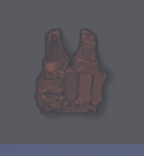</a><!--
--><!--
--><!--
--><!--
--><!--
-->
 
<!--
--><a href="#bomb">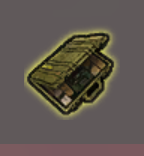</a><!--
--><!--
--><a href="#rocket-launcher">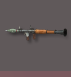</a><!--
--><!--
--><a href="#ranger-shotgun">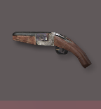</a><!--
--><!--
--><!--
--><!--
--><a href="#riot-shield">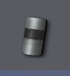</a><!--
--><!--
--><a href="#spas-12-shotgun">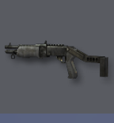</a><!--
--><!--
--><a href="#stun-grenade">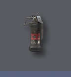</a><!--
-->
 
<!--
--><a href="#throwing-knife">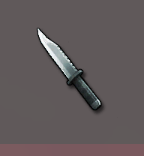</a><!--
--><!--
--><a href="#claymore">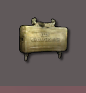</a><!--
--><!--
--><a href="#flashbang">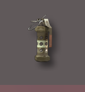</a><!--
--><!--
--><!--
--><!--
--><!--
--><!--
--><a href="#camera">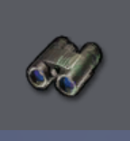</a><!--
--><!--
--><a href="#smell-o-vision">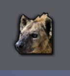</a><!--
-->
 
 

### 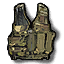&ensp;Armor
Armor is a flat incoming damage reduction for the wearer.
It only reduces bullet damage and is thus ineffective against explosions.
Headshot damage is not reduced by armor either.

🔵 Detectives are given armor by default and do not need to buy this item.

⚙️ The damage reduction value is [configurable](#configurable-settings) using the `ttt_armor_damage_multiplier` dvar.

	
🎥 <b>Demo Video</b>

	 
	<video src="https://user-images.githubusercontent.com/21311428/127512347-e813fabd-999a-49b9-9df9-109e9e8a0f27.mp4"></video>

***

### &ensp;Radar
The Radar acts similar to the MW2 UAV:
The position of all players is periodically shown on the minimap.
It does not discern between player's roles.
Contrary to the base game, the Radar cannot be destroyed and will stay active indefinitely.

	
🎥 <b>Demo Video</b>

	 
	<video src="https://user-images.githubusercontent.com/21311428/127513063-a90864e2-db46-40e6-96f7-258febb74a1c.mp4"></video>

***

### &ensp;Attack Helicopter
The Attack Helicopter patrols the map for 1 minute.
It will target **anyone** in it's sightline, including traitors.
The helicopter's health scales with the amount of living players when it is called in.

The item can be used to constrain players to buildings or to find an opening while players
are distracted with shooting it down.

	
🎥 <b>Demo Video</b>

	 
	<video src="https://user-images.githubusercontent.com/21311428/127513804-c01663c9-ec5d-43ad-8106-63b9f83879d0.mp4"></video>

***

### 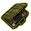&ensp;Bomb
After buying the Bomb, it can be planted anywhere on the map.
It will explode in a huge (configurable) radius once it's timer reaches zero.
The explosion damage does not take map geometry into account.
While ticking, the Bomb emits a sound that can be heard at close distance.

Players can decide to defuse a planted bomb.
Depending on server configuration, this has a chance to fail, causing the bomb to explode instantly.
A defused bomb cannot be re-planted.

🔴 All traitors can see planted bombs and their timers.

⚙️ [Configurable](#configurable-settings) via:
- `ttt_bomb_radius`
- `ttt_bomb_timer`
- `ttt_bomb_defuse_failure_pct`

	
🎥 <b>Demo Video</b>

	 
	<video src="https://user-images.githubusercontent.com/21311428/127529308-4a5d7641-3544-42a2-9254-e7829bfe34ab.mp4"></video>

***

### 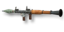&ensp;Rocket Launcher
The Rocket Launcher is a single-use role exclusive weapon.
It deals damage in a radius and can thus weaken or kill targets that group up very close together.
The weapon cannot be refilled with ammo pickups.
By default, the weapon only one-hit-kills at the center of the explosion.

⚙️ The damage is [configurable](#configurable-settings) with the `ttt_rpg_multiplier` dvar.

	
🎥 <b>Demo Video</b>

	 
	<video src="https://user-images.githubusercontent.com/21311428/127519737-66d459f2-5f07-4f75-9550-bdda6db943c8.mp4"></video>

***

### 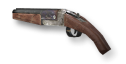&ensp;Ranger Shotgun
The Ranger Shotgun is a high-damage role exclusive shotgun.
As in base MW2, the weapon can shoot twice without any delay.
This either allows for a single powerful attack, or damaging two targets within one reload.

	
🎥 <b>Demo Video</b>

	 
	<video src="https://user-images.githubusercontent.com/21311428/127519063-19cbe359-1ae7-490b-ab88-bba1829cde62.mp4"></video>

***

### &ensp;Throwing Knife
Similar to the Throwing Knife in the regular gamemodes, this weapon can one-hit-kill an enemy.
What makes it especially viable is it's ability to hit silently:
Neither using the weapon itself makes a sound, nor will the victim scream when killed by it.

	
🎥 <b>Demo Video</b>

	 
	<video src="https://user-images.githubusercontent.com/21311428/127521356-da34bb8a-ac40-4125-81e0-3066d400aea2.mp4"></video>

***

### 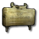&ensp;Claymore
The Claymore allows traitors to setup traps to lure innocent players towards.
This version of the Claymore explodes when **anyone** walks in front of it, including traitors.

In contrast to regular MW2, the item does not make a sound when placed down.
Additionally, it has a configurable delay until it is armed, to allow for placement in corners.

🔴 All traitors can see planted claymores through walls (highlighted in red).

⚙️ [Configurable](#configurable-settings) via:
- `ttt_claymore_multiplier`
- `ttt_claymore_delay`

	
🎥 <b>Demo Video</b>

	 
	<video src="https://user-images.githubusercontent.com/21311428/127516710-f3043048-e640-4972-b91e-610f101e67e5.mp4"></video>

***

### &ensp;Flashbang
The Flashbang is equivalent to the one in the base game:
It temporarily blinds and deafens targets, looking into or standing inside of the explosion.

The Flashbang can be used to clear rooms, or to disorient a group of players.

	
🎥 <b>Demo Video</b>

	 
	<video src="https://user-images.githubusercontent.com/21311428/127517090-fd0797b9-c724-4aaa-9c3b-7752fd18fbcb.mp4"></video>

***

### &ensp;Hyperspeed
This item grants the wearer a configurable amount of increased base speed.
The effect can be used to follow players, escape situations, win fast-paced gunfights,
or simply to get around the map quicker.

⚙️ The speed can be [configured](#configurable-settings) with the `ttt_speed_item_mutiplier` dvar.

	
🎥 <b>Demo Video</b>

	 
	<video src="https://user-images.githubusercontent.com/21311428/127518281-746f01e2-b874-4866-917f-72d0d1f89783.mp4"></video>

***

### &ensp;Insane Biceps
As the Detective's equivalent to the Throwing Knife,
this instant muscle-upgrade can be used to throw weapons at deadly velocity.

Any weapon held in hand can be thrown using the drop key (<kbd>N</kbd> by default).
It will fly in a trajectory, killing any players hit on the way.

Throwing a weapon comes in handy as a last resort when running out of ammo.
Likewise it is possible to restrict weapon access by throwing them far away.
Especially useful for the most stylish of kills, though.

	
🎥 <b>Demo Video</b>

	 
	<video src="https://user-images.githubusercontent.com/21311428/127518526-b8f7b3c3-0f8b-48f4-b092-6fc09095308c.mp4"></video>

***

### 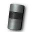&ensp;Riot Shield
The Riot Shield can be used to block bullets either by equipping it,
or passively on the wearer's back.

As with other role exclusive weapons, the Riot Shield is equipped in an extra role weapon slot.
Thus it can be carried alongside two regular weapons.

	
🎥 <b>Demo Video</b>

	 
	<video src="https://user-images.githubusercontent.com/21311428/127519277-1fd0f352-96a4-4154-bd1f-76de1ec98bf9.mp4"></video>

***

### 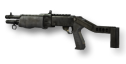&ensp;SPAS-12 Shotgun
The SPAS-12 Shotgun is an offensive option for the Detective.
It is viable across longer ranges than other shotguns.

	
🎥 <b>Demo Video</b>

	 
	<video src="https://user-images.githubusercontent.com/21311428/127520821-ac435104-ab16-4a57-aa57-97676adb80e3.mp4"></video>

***

### 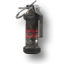&ensp;Stun Grenade
The Stun Grenade is equivalent to the one in the base game:
It can be thrown faster than a flashbang
and slows down movement and aiming of players caught in it's radius.

	
🎥 <b>Demo Video</b>

	 
	<video src="https://user-images.githubusercontent.com/21311428/127521072-1cd2b99d-e1d1-4a3f-9a3c-53563716e9f8.mp4"></video>

***

### &ensp;Health Station
The Health Station is the only way to restore player health.
It can be freely placed down, after which **anyone** can use it to slowly restore their health.

The item has a maximum amount of health it can dispense.
Once the health points are depleted or when the Health Station takes too much damage,
it will be destroyed.

	
🎥 <b>Demo Video</b>

	 
	<video src="https://user-images.githubusercontent.com/21311428/127517425-ca02a835-16f2-4d3e-8f04-17d654693e6c.mp4"></video>

***

### 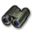&ensp;Camera
Being freely placeable on any wall, the Camera allows it's owner to remotely observe an area.
Once placed, the receiver laptop can be used to look through the Camera's eye on demand.

This can be used to observe suspicious players, or to prevent traitor activity in an area
(e. g. in front of the Detective and trustworthy players).

The Camera can be destroyed after taking too much damage.
This will stop the receiver from functioning.

	
🎥 <b>Demo Video</b>

	 
	<video src="https://user-images.githubusercontent.com/21311428/127515822-6a04672c-ba8c-4be7-b391-5fc1052269c4.mp4"></video>

***

### 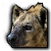&ensp;Smell-O-Vision
Smell-O-Vision enables player-tracking via their smell:
Whenever a player moves on the map, they will leave a visible trail to the owner of this item.

This can be used to track players and investigate who was at a specific scene previously.

	
🎥 <b>Demo Video</b>

	 
	<video src="https://user-images.githubusercontent.com/21311428/127520125-4126eaca-0816-490d-b9cb-8a190a6849f2.mp4"></video>

 

## Installation
The gamemode features an (optional but strongly recommended) asset modification.
This provides some custom weapons (e. g. the standalone knife),
3D assets and sounds to flesh out and better balance the gamemode.

The mod can be downloaded on this project's [releases page](../../../releases/).  
To install, place the folder *inside* of the zip archive into: `<IW4X>/mods`

The script files can either be placed in the extracted folder to be loaded with the mod
(`<IW4X>/mods/ttt-<version>`), or inside of `<IW4X>/userraw` to always load them on startup.

⚠️ [Note that some base game dvars should be changed for a good experience.](#recommendations)

## Configurable Settings
| Dvar                               | Description                                                                                                                     | Default Value |
|------------------------------------|---------------------------------------------------------------------------------------------------------------------------------|--------------:|
| ttt_roundlimit                     | Rounds per map.                                                                                                                 |             8 |
| ttt_timelimit                      | Timelimit per round in minutes. (Not including preptime.)                                                                       |           5.0 |
| ttt_preptime                       | Length of the preparation phase (in seconds), where players can pick up weapons before roles are drawn.                         |            30 |
| ttt_aftertime                      | Delay between the round ending and the final killcam being shown (in seconds).                                                  |            10 |
| ttt_summary_timelimit              | Total time period the round summary will be shown for (in seconds).                                                             |            25 |
| ttt_summary_rounds_per_view        | Amount of rounds to show at once in the summary. Note that the GUI only supports up to 6-7 rounds displayed at once.            |             4 |
| ttt_summary_time_per_view          | Time (in seconds) until the summary displays the next wave of rounds after the animation finishes.                              |            10 |
| ttt_traitor_pct                    | Fraction of players that will become traitors. The number of players will be multiplied by this number and then rounded down.   |           0.4 |
| ttt_detective_pct                  | Fraction of players that will become detectives. The number of players will be multiplied by this number and then rounded down. |          0.17 |
| ttt_headshot_multiplier            | Damage multiplier on headshot.                                                                                                  |           2.0 |
| ttt_headshot_multiplier_sniper     | Damage multiplier on headshot with a sniper rifle.                                                                              |           2.5 |
| ttt_knife_damage                   | Base damage dealt by melee attacks (excluding the Riot Shield).                                                                 |           100 |
| ttt_knife_weapon_backstab_angle    | Maximum angle difference (in degrees) at which the knife weapon (standalone) can one-hit-kill players in the back.              |            50 |
| ttt_armor_damage_multiplier        | Incoming (non-headshot) bullet damage multiplier for wearing armor.                                                             |           0.8 |
| ttt_speed_item_mutiplier           | Speed multiplier for the hyperspeed detective item.                                                                             |           1.3 |
| ttt_rpg_multiplier                 | Damage multiplier for the RPG-7 traitor item.                                                                                   |           1.8 |
| ttt_claymore_multiplier            | Damage multiplier for claymore traitor item.                                                                                    |           2.2 |
| ttt_claymore_delay                 | Delay (in seconds) until a claymore activates.                                                                                  |           3.0 |
| ttt_bomb_radius                    | Radius (in world units) in which the bomb damages players. Damage is fatal in the inner 2/3 of the radius.                      |          1536 |
| ttt_bomb_timer                     | Time (in seconds) until a planted bomb (traitor item) explodes.                                                                 |            45 |
| ttt_bomb_defuse_failure_pct        | Chance (fraction) that a defusing a bomb will fail, resulting in an instant explosion.                                          |           0.2 |
| ttt_feign_death_invis_time         | Length of invisibility (in seconds) when activating Feign Death.                                                                |           6.0 |
| ttt_upgradestation_amount_required | Number of weapons required for a trade-in at an upgrade station.                                                                |             4 |
| ttt_falldamage_min                 | Units of distance after which a fall will damage a player.                                                                      |           210 |
| ttt_falldamage_max                 | Units of distance after which a fall will damage a player for their maximum health.                                             |           400 |
| ttt_traitor_start_credits          | Amount of shop credits every traitor starts the round with.                                                                     |             1 |
| ttt_traitor_kill_credits           | Amount of shop credits awarded to a traitor for killing an innocent or detective.                                               |             1 |
| ttt_detective_start_credits        | Amount of shop credits every detective starts the round with.                                                                   |             1 |
| ttt_detective_kill_credits         | Amount of shop credits awarded to a detective for killing a traitor.                                                            |             1 |

### Recommendations
⚠️ Furthermore there are some settings from the base game that should be changed for a better experience:
| Dvar                       | Description                                                                           | Recommended Value |
|----------------------------|---------------------------------------------------------------------------------------|------------------:|
| g_gametype                 | Needs to be set to run the gamemode.                                                  |               ttt |
| scr_player_maxhealth       | The player's total health on spawn.                                                   |               250 |
| scr_player_healthregentime | Time in seconds after which health regeneration kicks in. (Set to `0` to disable.) |                 0 |
